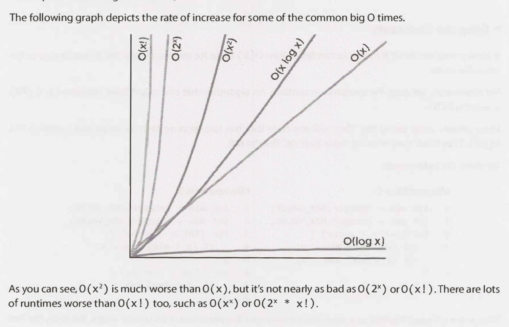

# Big O

It is very possible for O(N) code to run faster than 0(1) code for specific inputs. Big O just describes the **rate of increase**.

Rate of increase: `O(N!)>O(2^N)>O(N^2)>O(NlogN)>O(N)>O(logN)>O(1)`

1. O(N^2) _10x the data take 100x more time_
2. O(NlogN) _10x the data means about 20x more time_
3. O(N) _10x the data means 10x more time_
4. O(logN) _10x the data means 2x (because log2(N)~ 2N) more time_
5. O(1) _Speed doesn't depend on the size of the dataset_

### notes of big O notation

- O(N!) will occur when calculating [permutations](https://en.wikipedia.org/wiki/Permutation#k-permutations_of_n), for a string `s` of length n, it has a total n! permutation of the string `s`.

- Due to the use of the binary numeral system by computers, the logarithm is frequently base 2. However, by the change of base for logarithms, loga n and logb n differ only by a constant multiplier, which in big-O notation is discarded; thus O(log n) is the standard notation for logarithmic time algorithms regardless of the base of the logarithm.

- The base of a log doesn't matter for big O since logs of different bases are only different by a constant factor. However, this does not apply to exponents. The base of an exponent does matter. Compare 2^N and 8^N. 8^N and 2^N are different by a factor of 2^2N. That is very much not a constant factor!

## Amortized Time

When an `insertion` occurs in a dynamic array, and the array could be full. If the array contains N elements, `insertion` will take O(N) time. You will have to create a new array of size 2N and then copy N elements over. This insertion will take O(N) time.This worst case happens every once in a while. But once it happens, it won't happen again for so long that the cost is "amortized".

As we insert elements, we double the capacity when the size of the array is a power of 2. So after X elements, we double the capacity at array sizes 1, 2, 4, 8, 16, ..., X.That doubling takes, respectively, 1, 2, 4, 8, 16, 32, 64, ..., X copies.

What is the sum of 1 + 2 + 4 + 8 + 16 + ... + X?
Equally the sum of X+ X/2+ X/4+ X/8+...+1? X(1+1/2+1/4.....)
this is a [geometric series](https://en.wikipedia.org/wiki/Geometric_progression#Geometric_series) and can use formula: **`a*(1-r^n)/(1-r)`** to get the sum.
This is roughly 2X.

Therefore, X insertions take 0(2X) time.The amortized time for each insertion is 0(1).

## Recursive Function

When you have a recursive function that makes multiple calls, the runtime will often (but not always) look like **O(branches^depth)**, where branches is the number of times each recursive call branches.

## Example of calculating Big O:

Suppose we had an algorithm that took in an array of strings, sorted each string, and then sorted the full array. What would the runtime be?
_(Be rigorous)_

Now we can work through this in parts:

1. Sorting each string is `O(slog s)`.
1. We have to do this for every string, so that's `O(a*slog s)`.
1. Now we have to sort all the strings. And each string comparison takes `O(s)` time. There are `O(alog a)` comparisons, therefore this will take O(a*s log a) time.
   If you add up these two parts, you get `O(a*s(log a + log s))`.
